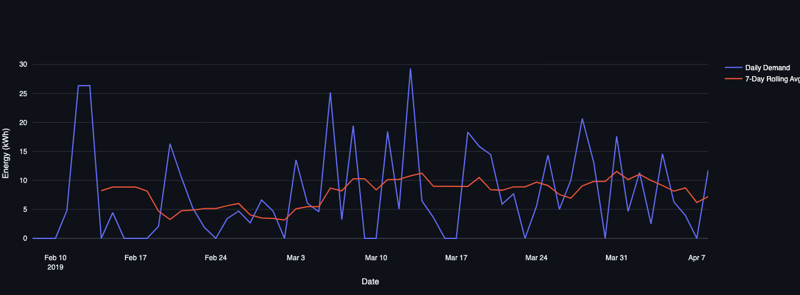
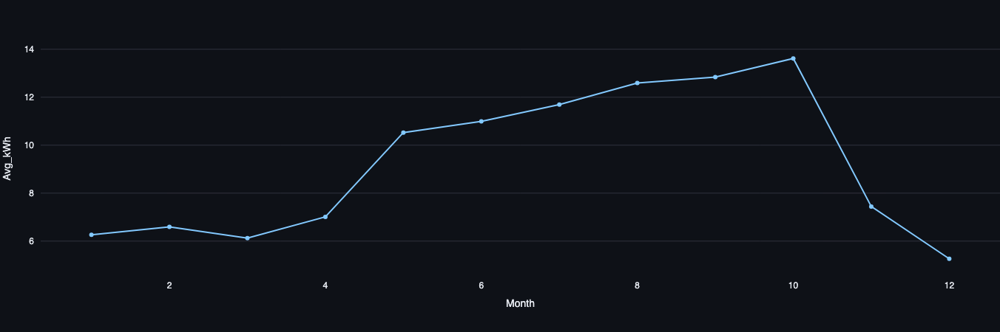
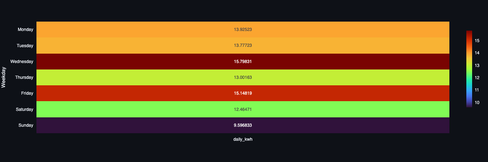
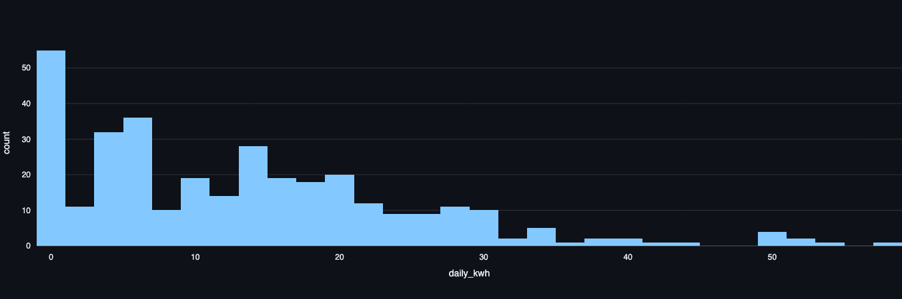

# Project 15: Intelligent EV Charging Demand Prediction & Agentic Infrastructure Planning

## From Usage Analytics to Autonomous Grid & Station Planning

---

##  Milestone 1 - Project Overview

With increasing EV adoption, accurate charging demand forecasting is essential for:

- Grid stability
- Infrastructure scaling
- Load balancing
- Energy optimization
- Smart city planning

This project builds a complete pipeline including:

- Hourly demand aggregation
- Daily demand forecasting
- Demand occurrence classification
- Feature engineering with lag & rolling statistics
- Ensemble-based regression modeling

---

##  Feature Engineering

The forecasting models use advanced time-series features:

###  Time Features
- Hour of day
- Day of week
- Month
- Weekend indicator
- Cyclical encoding (sin/cos transformation)

### Lag Features
- lag_1 (previous period demand)
- lag_7 (weekly dependency)
- lag_24 (daily seasonality)
- lag_14 (extended weekly memory)

###  Rolling Statistics
- Rolling mean (7-day, 14-day, 24-hour)
- Volatility estimation

These features allow the model to capture temporal dependencies, seasonality, and trend behavior.

---

## Exploratory Data Analysis

###  Historical Demand Trend


###  Monthly Demand Trend


###  Weekly Demand Pattern


### Demand Distributions


---

##  Evaluation Metrics

- MAE (Mean Absolute Error)
- RMSE (Root Mean Squared Error)
- R² Score

---

---

## Milestone 2: Agent-Based EV Infrastructure Planning System

In this stage of the project, the traditional machine learning pipeline is extended by integrating a language model-based agent to provide intelligent and actionable insights based on predicted EV charging demand.

The goal is not only to predict demand but also to assist in decision-making for infrastructure planning using AI-generated reasoning.

---

## System Workflow

The system follows a structured pipeline:

1. The user selects a charging station and a specific date through the Streamlit interface.

2. The machine learning model processes historical data and predicts the expected EV charging demand for the selected station and date.

3. The predicted demand is passed to a language model (LLM) through an agent module.

4. The agent analyzes the demand level and generates structured recommendations, including system status, reasoning, and suggested actions.

5. The final output is displayed on the interface along with visualizations and insights.

---

## Agent Design

The agent acts as a reasoning layer on top of the machine learning model.

- It takes numerical predictions (demand values) as input.
- It converts them into meaningful insights using a language model.
- It produces structured outputs such as:
  - Demand status (low, moderate, high)
  - Reasoning behind the classification
  - Actionable recommendations for infrastructure planning

The agent uses a prompt-based approach and communicates with the Groq API to generate responses.

A fallback rule-based system is also implemented to ensure reliability in case the API fails.

---

## Integration with Machine Learning Model

The machine learning model remains the core predictive component of the system.

- It performs time-series based forecasting using engineered features such as lag values and rolling statistics.
- The predicted demand value is used as the primary input for the agent.
- The agent does not replace the model but enhances its usability by adding interpretability and decision support.

---

## RAG Module (Future Scope)

A Retrieval-Augmented Generation (RAG) module is included in the project structure but is currently not active.

- The retriever module is designed to fetch relevant EV-related knowledge.
- It can be extended using vector databases such as FAISS or ChromaDB.
- In future versions, this will allow the agent to generate more context-aware and knowledge-driven responses.

---

## System Architecture

The overall system can be represented as:

User Input → ML Prediction → Agent (LLM) → Recommendations → UI

This modular design allows easy extension of components such as the agent logic or retrieval system.

---

## Output of the System

The system produces:

- Predicted EV charging demand (kWh)
- Visual representation of trends
- AI-generated recommendations
- System status and interpretation

This makes the system useful not only for prediction but also for planning and decision-making.

---

##  Project Structure
├── EV-CHARGING-DEMAND-PREDICTION
│   ├── .gitignore
│   ├── .streamlit
│   │   └── config.toml
│   ├── DOCUMENTATION.md
│   ├── README.md
│   ├── agent
│   │   └── nodes.py
│   ├── app.py
│   ├── data
│   │   └── caltech_full.csv
│   ├── documentation
│   │   ├── EV_CHARGING_DEMAND_PREDICTION.pdf
│   │   ├── Final_architecture.pdf
│   │   └── system_architect_diagram'.png
│   ├── images
│   │   ├── Demand_Distribution.png
│   │   ├── Historical_Trend.png
│   │   ├── Monthly_Average_Demand.png
│   │   └── Weekly_Demand_Pattern.png
│   ├── models
│   │   ├── active_stations.pkl
│   │   ├── ev_demand_model.pkl
│   │   └── features.pkl
│   ├── notebooks
│   │   └── forcasting.ipynb
│   ├── requirements.txt
│   ├── src
│   │   ├── agent
│   │   │   ├── __init__.py
│   │   │   └── agent.py
│   │   ├── charts.py
│   │   ├── demand_model.py
│   │   ├── eda_analysis.py
│   │   ├── models
│   │   │   ├── __init__.py
│   │   │   └── demand_model.py
│   │   ├── preprocessing.py
│   │   ├── rag
│   │   │   ├── __init__.py
│   │   │   └── retriever.py
│   │   ├── train_daily.py
│   │   └── utils
│   │       ├── __init__.py
│   │       └── helpers.py
│   └── video
│       └── Model_Minds_SectionD.mp4
├── package-lock.json
└── package.json


---

## Deployed Link

[Hosted Application](https://evpreds.streamlit.app/)


## Model Persistence

Trained models are saved using joblib:

```python
import joblib
model = joblib.load("daily_model.pkl")


